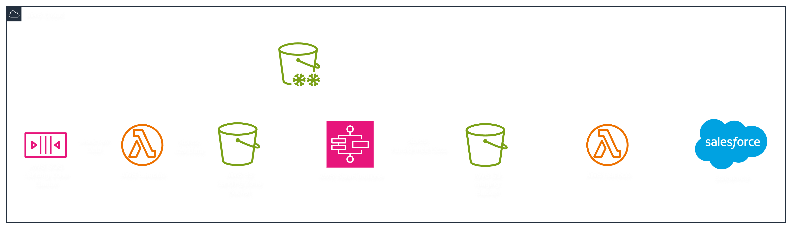

# AWS Trainings

Dieses Repository begleitet eine praxisorientierte Lernreihe. Ziel ist es, in kurzen Micro-Trainings (90 Min) und
ergänzenden Self-paced-Abschnitten wiederverwendbare Infrastruktur mit Terraform in AWS aufzubauen – Schritt für Schritt
bis zu einer produktionsnahen Integration-Layer.

## Einführung

### Zielbild



### Trainings

1. Training – Terraform & S3: Terraform-Workspace und S3-Buckets mit Best-Practices
2. Training – Lambda & SQS: SQS-Queue, Lambda-Trigger und rudimentäre Verarbeitung
3. Training - Step Functions & Monitoring: Orchestrierung und CloudWatch/Costs/Observability-Basics
4. Training - IAM & Externe API Push via Lambda: Berechtigungen und Push zu Salesforce
5. Training - tbd: (z.B.) CI/CD für Terraform, Replikation/DR, Storage Lens, Data Events

#### Trainingsformat

1. Einführung (≤ 10 min): Ziel, Scope, Theorie-Kurzüberblick
2. Hands-on (≈ 45 min): eigenständige Umsetzung
3. Review & Diskussion (≈ 30 min): Lösungen, Best Practices, Ausblick

### Voraussetzungen

- Terraform CLI ≥ 1.5
- AWS CLI konfiguriert
- Editor mit HCL-Unterstützung

### Quickstart

```shell
# 1) Repo klonen & in Trainings-Branch wechseln
git clone https://github.com/lhaidacher-bpt/aws-trainings.git
cd aws-trainings
git checkout <TRAININGS_BRANCH>

# 2) Lokale Variablen vorbereiten
cp docs/terraform.tfvars.example terraform.tfvars 
# Werte in terraform.tfvars anpassen

# 3) Terraform-Workflow
terraform init
terraform fmt -recursive
terraform validate
terraform plan
terraform apply
```

## 1. Training: Terraform & S3

**Ziel**: Terraform-Workspace initialisieren und drei S3-Buckets (logs, landing, staging) mit soliden Defaults erstellen

### Lernziel

- Terraform-Workflow sicher anwenden: fmt → validate → plan (→ apply)
- Ein minimales, wiederverwendbares S3-Bucket-Modul erstellen
- Best Practices: Block Public Access, Versioning, Default Encryption (SSE-S3), TLS-only-Policy, Lifecycle

### Aufgaben

1. Workspace vorbereiten (init & .tfvars kopieren)
2. Terraform Modul bauen
    - Resources: [AWS Provider](https://registry.terraform.io/providers/hashicorp/aws/latest/docs)
    - Inputs: `bucket_name`, `enable_versioning`, `encryption_type`, `block_public_access`, `lifecycle`
    - BucketOwnerEnforced ist aktiviert
    - Outputs: `bucket_name`, `bucket_arn`
3. Drei Instanzen anlegen
    - logs: Transition → nach 30 Tagen zu INTELLIGENT_TIERING, Expire 365
    - landing: Expire 180, Abort incomplete MPU 7
    - staging: Transition → 60 Tage zu INTELLIGENT_TIERING, Expire 730
    - Einheitliches Naming `<$PROJECT_NAME>-<$PARTICIPANT>-<$ZWECK>`
4. Validate & Plan
    - Formatierung
    - Validierung
    - Planung

### Definition of Done

- 3 Buckets existieren mit Object Ownership und Policies
- `terraform fmt/validate/plan` ohne Fehler
- `outputs` listen die drei Bucket-Namen
