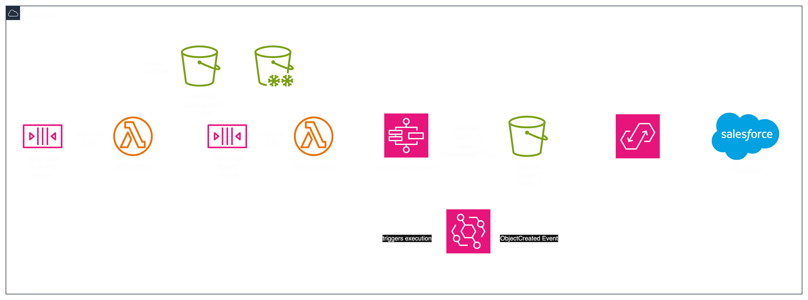
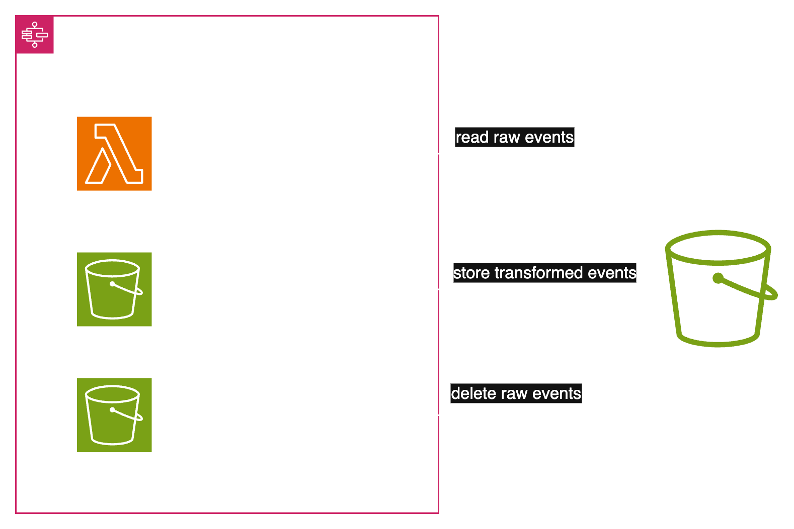

# AWS Trainings

Dieses Repository begleitet eine praxisorientierte Lernreihe. Ziel ist es, in kurzen Micro-Trainings (90 Min) und
ergänzenden Self-paced-Abschnitten wiederverwendbare Infrastruktur mit Terraform in AWS aufzubauen – Schritt für Schritt
bis zu einer produktionsnahen Integration-Layer.

## Einführung

### Zielbild



### Trainings

1. Training – Terraform & S3: Terraform-Workspace und S3-Buckets mit Best-Practices
2. Training – Lambda & SQS: SQS-Queue, Lambda-Trigger und rudimentäre Verarbeitung
3. Training - Step Functions & Monitoring: Orchestrierung und CloudWatch/Costs/Observability-Basics
4. Training - IAM & Externe API Push via Lambda: Berechtigungen und Push zu Salesforce
5. Training - tbd: (z.B.) CI/CD für Terraform, Replikation/DR, Storage Lens, Data Events

#### Trainingsformat

1. Einführung (≤ 10 min): Ziel, Scope, Theorie-Kurzüberblick
2. Hands-on (≈ 45 min): eigenständige Umsetzung
3. Review & Diskussion (≈ 30 min): Lösungen, Best Practices, Ausblick

### Voraussetzungen

- Terraform CLI ≥ 1.5
- AWS CLI konfiguriert
- Editor mit HCL-Unterstützung

### Quickstart

```shell
# 1) Repo klonen & in Trainings-Branch wechseln
git clone https://github.com/lhaidacher-bpt/aws-trainings.git
cd aws-trainings
git checkout <TRAININGS_BRANCH>

# 2) Lokale Variablen vorbereiten
cp docs/samples/terraform.tfvars.example terraform.tfvars 
# Werte in terraform.tfvars anpassen

# 3) Terraform-Workflow
terraform init
terraform fmt -recursive
terraform validate
terraform plan -refresh=false
terraform apply
```

## 1. Training: Terraform & S3

**Ziel**: Terraform-Workspace initialisieren und drei S3-Buckets (logs, landing, staging) mit soliden Defaults erstellen

### Lernziel

- Terraform-Workflow sicher anwenden: fmt → validate → plan (→ apply)
- Ein minimales, wiederverwendbares S3-Bucket-Modul erstellen
- Best Practices: Block Public Access, Versioning, Default Encryption (SSE-S3), Lifecycle

### Aufgaben

1. Workspace vorbereiten (init & .tfvars kopieren)
2. Terraform Modul(e) bauen
    - Resources: [AWS Provider](https://registry.terraform.io/providers/hashicorp/aws/latest/docs)
    - Inputs: `bucket_name`, `enable_versioning`, `encryption_type`, `block_public_access`, `lifecycle`
    - BucketOwnerEnforced ist aktiviert
    - Outputs: `bucket_name`, `bucket_arn`
3. Drei Instanzen anlegen
    - logs: Transition → nach 30 Tagen zu INTELLIGENT_TIERING, Expire 365
    - landing: Expire 180, Abort incomplete MPU 7
    - staging: Transition → 60 Tage zu INTELLIGENT_TIERING, Expire 730
    - Einheitliches Naming `<$PROJECT_NAME>-<$PARTICIPANT>-<$ZWECK>`
4. Validate & Plan
    - Formatierung
    - Validierung
    - Planung

### Definition of Done

- 3 Buckets existieren mit Object Ownership und Policies
- `terraform fmt/validate/plan` ohne Fehler
- `outputs` listen die drei Bucket-Namen

## 2. Training: SQS & Lambda

**Ziel**: Eingehende Nachrichten über eine SQS Queues und Lambdas verarbeiten und aufbereiten

### Lernziele

- SQS zu Lambda Event Source Mapping (Batching, Partial Batch Failure)
- Least-Privilege IAM für S3 PutObject, SQS Receive/Delete/Send
- Node.js 22 Lambda (AWS SDK v3, keine zusätzlichen Packages)

### Aufgaben

1. Workspace vorbereiten (init & .tfvars kopieren)
2. Queues anlegen (jeweils mit DLQ & Redrive Policy)
    - Landing
    - Splitter
3. Lambda „Extract“ (SQS Landing → S3 Landing → SQS Splitter)
    - Event Source Mapping konfigurieren (Batching, Partial Batch Failure)
    - Nachricht als NDJSON im S3-Landing-Bucket ablegen: `s3://<LANDING_BUCKET>/raw-message/<messageId>.ndjson`
    - Audit-Drop als JSON im Logs-Bucket ablegen: `s3://<LOGS_BUCKET>/landing-audit/<messageId>.json`
    - Original-Nachricht an SQS-Splitter-Queue weiterleiten
4. Lambda „Splitter“ (SQS Splitter → S3 Staging)
    - Event Source Mapping konfigurieren
    - events[] als einzelne JSON-Dateien im S3-Staging-Bucket
      speichern: `s3://<STAGING_BUCKET>/raw-events/<eventId>.json`
5. Validate & Plan
    - Formatierung
    - Validierung
    - Planung

### Definition of Done

- Eine Nachricht in der Landing Queue erzeugt eine NDJSON-Datei unter `raw-message/<messageId>.ndjson`
- Audit-Eintrag wird unter `landing-audit/<messageId>.json` erstellt
- Nachricht wird an Splitter Queue weitergeleitet
- Splitter legt pro Event eine JSON-Datei unter `raw-events/<eventId>.json` ab
- Partial Batch Failure ist aktiv und funktioniert
- DLQs bleiben leer bei gültigem Input
- `terraform fmt/validate/plan` ohne Fehler

## 3. Training: Step-Function

- **Ziel:** Eine "Standard" Step Function orchestriert die Verarbeitung eines einzelnen Events aus dem S3 Staging
  Bucket.

### Step-Function Architektur



### Lernziele

- Grundbausteine: Task (Lambda), AWS SDK Integrations (S3 Put/Delete)
- Parameters, OutputPath/ResultPath, ResultSelector, Intrinsics (States.Format, States.JsonToString,
  States.Base64Encode)
- (Optional) Retry auf Tasks

### Aufgaben

1. Workspace vorbereiten (init & .tfvars kopieren)
2. Lambda „Transform“
    - Implementieren der Lambda-Funktionalität in `/lambda/transform/index.mjs`
        - Einzelnes Event aus `s3://<STAGING_BUCKET>/raw-events/<eventId>.json` lesen
        - Roh-Event nach vorgegeben Schema transformieren
        - Transformiertes Event inklusive benötigte Parameter an nächsten Step übergeben
    - Implementieren der Terraform-Definition in `/modules/lambda_sf_tranform/main.tf`
        - Umsetzen der To-dos
        - Lambda-Terraform ist ausgelagert; Vorteil: Transformierung kann ausgetauscht werden, ohne StepFunction ändern
          zu müssen
3. Step-Function (Definition)
    - Implementieren laut Architektur - Bausteine: Transform-Lambda, S3-Put-Object und S3-Delete-Object
    - *Achtung*: auf Benennung der Return-Parameter achten
    - _lambda:invoke_ Parameter
        - FunctionName: `${var.transform_lambda_arn}`
        - Payload: `$`
    - _s3:putObject_ Parameter
        - Bucket: `$.bucket`
        - Key: `States.Format('transformed/id={}/{}.json', $.transformedId, $.millis)`
        - Body: `$.event`
        - ContentType: `application/json`
    - _s3:deleteObject_ Parameter
        - Bucket: `$.bucket`
        - Key: `$.rawId`
4. Anpassen der `main.tf`: Lambda und Step-Function hinzufügen
5. Validate & Plan
    - Formatierung
    - Validierung
    - Planung

### Definition of Done

- Eine Ausführung mit Input { "eventId": "<EVENT_ID>" }
    - legt genau eine Datei unter transformed/<EVENT_ID>/<millis>.json an (inkl. korrektes Mapping),
    - löscht das ursprüngliche Raw-Objekt raw-events/<EVENT_ID>.json.
- Der State Output enthält putResult.etag (durch ResultSelector) und weiterhin bucket/rawKey.
- terraform fmt/validate/plan ohne Fehler; Deployment erfolgreich.

## 4. Training: EventBridge und AppFlow

- EventBridge: s3:ObjectCreate-Event -> EventBridge -> trigger StepFunction (Training #3)
- AppFlow: EventBridge-Scheduler -> trigger AppFlow
- (optional) IAM: create execution role